# Technical Architecture & Deployment Specification
## Legal Metrology (Packaged Commodities) Rules, 2011 Compliance Checking System

### 1. Executive Summary
The **Legal Metrology Compliance System (METROLOGY-AI)** is an automated inspection and regulatory validation platform built under the statutory provisions of the **Legal Metrology Act, 2009** and the **Legal Metrology (Packaged Commodities) Rules, 2011 (LMR 2011)**. 

The software empowers Legal Metrology Inspectors, Enforcement Directors, and Laboratory Analysts to rapidly scan, process, validate, and document compliance for pre-packaged commodities sold across retail stores, supermarkets, and Indian e-commerce marketplaces.

---

### 2. Software Architecture Diagram

```mermaid
graph TD
    subgraph ClientLayer [Presentation & Client Layer]
        A1[Live Camera Scanner]
        A2[File Upload / Drag & Drop]
        A3[Preloaded Commodity Test Suite]
        A4[Principal Display Panel ROI Selector]
        A5[Enforcement Dashboard & Analytics]
    end

    subgraph ProcessingPipeline [Image Preprocessing & OCR Engine]
        B1[Grayscale & Adaptive Contrast Filter]
        B2[Tesseract.js OCR Pipeline]
        B3[Spatial Bounding Box Localization]
        B4[Normalized Coordinates Mapper]
    end

    subgraph RuleValidationEngine [Legal Metrology 2011 Rule Engine]
        C1[Rule 6 1 a: Manufacturer / Importer Address Check]
        C2[Rule 6 1 b: Generic Commodity Name Check]
        C3[Rule 6 1 c & Rule 12: SI Metric Unit Validator]
        C4[Rule 6 1 d: Month & Year Mfg/Expiry Validator]
        C5[Rule 6 1 e: MRP & Inclusive of Taxes Validator]
        C6[Rule 6 1 f: Unit Sale Price USP Calculator]
        C7[Rule 6 1 n: Grievance Redressal Phone & Email Validator]
        C8[Schedule II: Font Height vs PDP Area Calculator]
        C9[Section 36: Statutory Penalty & Fine Matrix]
    end

    subgraph ReportingEnforcement [Reporting & Enforcement Module]
        D1[Official Legal Metrology Inspection Report]
        D2[Section 36 Statutory Notice of Violation]
        D3[CSV / JSON Inspection Registry]
        D4[Local / Server State Persistence]
    end

    ClientLayer --> ProcessingPipeline
    ProcessingPipeline --> RuleValidationEngine
    RuleValidationEngine --> ReportingEnforcement
```



---

### 3. Core Subsystems

#### 3.1. Optical Character Recognition (OCR) & Label Preprocessing
- **Image Enhancement**: Grayscale conversion, contrast stretching factor $F = \frac{259(C + 255)}{255(259 - C)}$, adaptive binarization, and aspect ratio normalization.
- **Bounding Box Localization**: Maps detected text tokens to standardized spatial zones on the Principal Display Panel (PDP).
- **Multi-angle Packaging Analysis**: Supports front, back, and side panel evidence attachments.

#### 3.2. Legal Metrology (Packaged Commodities) Rule Engine
- **Regex & NLP Heuristic Parsing**:
  - `Rule 6(1)(a)`: Evaluates physical address completeness (plot/street, state, 6-digit postal PIN code).
  - `Rule 6(1)(c)`: Validates mandatory metric units (`g`, `kg`, `ml`, `l`, `N`, `U`) and rejects prohibited non-standard notations (`gm`, `gms`, `kgs`, `ltrs`).
  - `Rule 6(1)(e)`: Validates price numerals in INR and verifies presence of mandatory phrase `(inclusive of all taxes)`.
  - `Rule 6(1)(f)`: Computes Unit Sale Price (USP) for packs $\ge 1\text{ kg} / 1\text{ L}$ and cross-verifies price-per-gram accuracy.
  - `Rule 6(1)(n)`: Validates email regex (`[a-zA-Z0-9._%+-]+@[a-zA-Z0-9.-]+\.[a-zA-Z]{2,}`) and 10-digit / 1800-toll-free helpline numbers.
  - `Schedule II`: Computes minimum numeral font height based on package weight:
    - $\le 50\text{g} \to 1.0\text{mm}$
    - $50\text{g} - 200\text{g} \to 2.0\text{mm}$
    - $200\text{g} - 1000\text{g} \to 4.0\text{mm}$
    - $> 1000\text{g} \to 6.0\text{mm}$

#### 3.3. Statutory Penalty & Enforcement Actions (Section 36)
- Evaluates statutory compounding penalties under Section 36(1) of the Legal Metrology Act, 2009:
  - First Offence: Fine up to ₹ 25,000.
  - Second Offence: Fine up to ₹ 50,000.
  - Subsequent Offences: Fine up to ₹ 1,00,000 or imprisonment up to 1 year.
- Flags immediate batch seizure recommendations for critical multi-clause non-compliances.

---

### 4. Deployment & Infrastructure Framework

#### 4.1. Local & On-Premises Deployment
1. **Zero-Dependency Static Host**:
   - The frontend is built with vanilla standard modern JavaScript (ES6+), HTML5, and CSS3.
   - Run instantly using any web server:
     ```bash
     # Using Python
     python -m http.server 8080

     # Using Node.js
     npx serve .
     ```
2. **Dockerized Deployment**:
   ```dockerfile
   FROM nginx:alpine
   COPY . /usr/share/nginx/html
   EXPOSE 80
   CMD ["nginx", "-g", "daemon off;"]
   ```

#### 4.2. Cloud & Government Portal Integration (NIC / Cloud PaaS)
- **Edge Deployment**: Cloudflare Pages / AWS S3 + CloudFront / Google Cloud Storage.
- **RESTful Enforcement API**: Extensible for server-side integration with National Consumer Helpline (NCH) and e-Daakhil consumer grievance portals.
